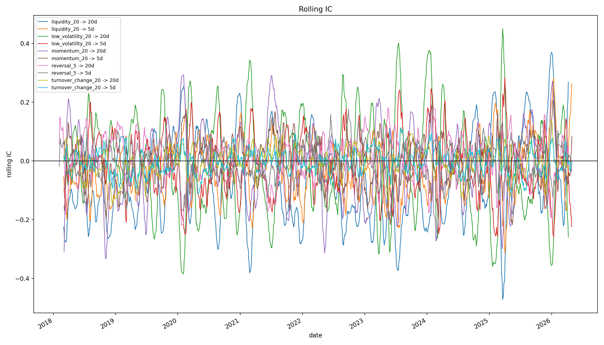
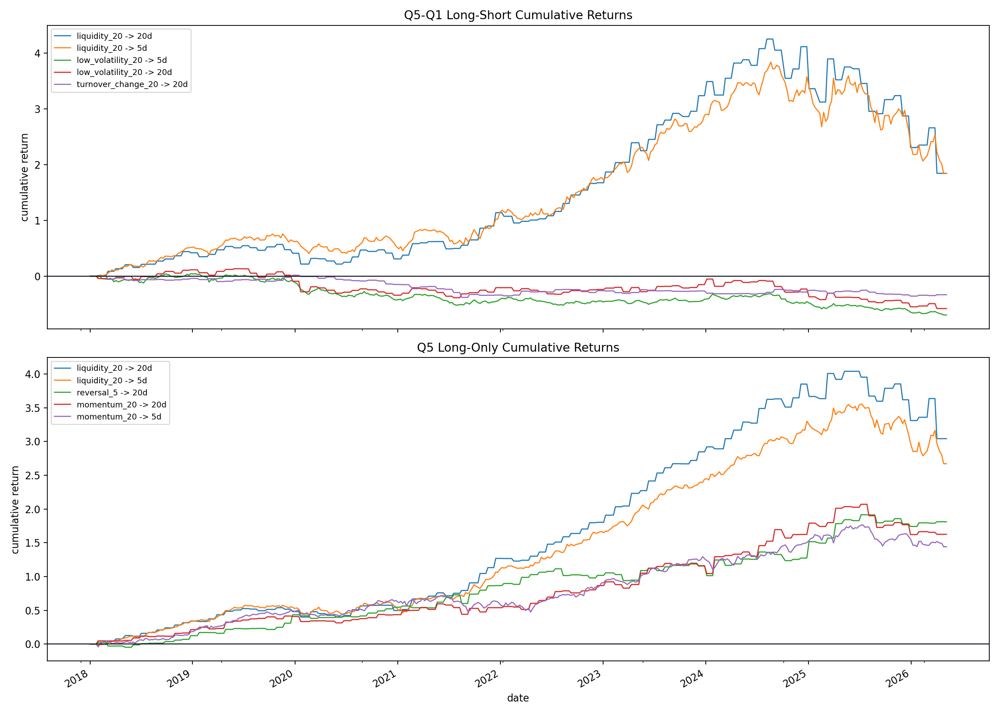
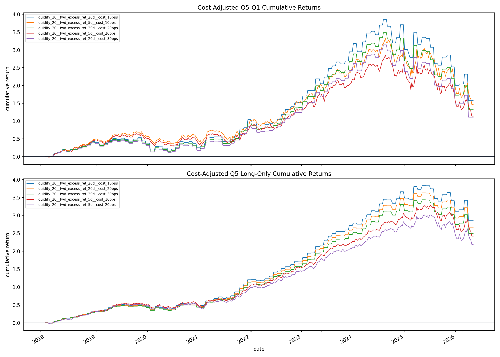

# 中证 500 因子研究报告

## 1. 研究问题

本项目将构建一个基于中证 500 成分股日频行情数据的横截面量价因子研究框架。
核心任务是自主实现从数据清洗、因子构造、未来超额收益对齐、
IC / Rank IC 分析、五分组回测、交易成本敏感性到 bootstrap 稳健性检验的完整流程。

## 2. 数据

|  |  |
| --- | --- |
| 股票池 | CSI500 |
| Benchmark | 000905 |
| 开始日期 | 2018-01-02 |
| 结束日期 | 2026-05-08 |
| 股票面板行数 | 906321 |
| 股票数量 | 499 |
| Benchmark 行数 | 2022 |
| Benchmark 开始日期 | 2018-01-02 |
| Benchmark 结束日期 | 2026-05-08 |

## 3. 因子定义

| 因子 | 定义 |
| --- | --- |
| 5 日反转 | - 过去 5 个交易日收益率 |
| 20 日动量 | 过去 20 个交易日收益率 |
| 20 日低波动性 | - 过去 20 个交易日收益波动率 |
| 20 日换手率 | 当前换手率 / 过去 20 日平均换手率 - 1 |
| 20 日流动性 | 过去 20 日平均成交额取对数 |

## 4. 标签构造

| 标签 | 构造方式 |
| --- | --- |
| 5 日超额收益 | 个股 5 日未来收益 - Benchmark 5 日未来收益 |
| 20 日超额收益 | 个股 20 日未来收益 - Benchmark 20 日未来收益 |

## 5. IC 分析

| 因子，标签 | IC 均值 | ICIR | Rank IC 均值 | Rank ICIR | Rank IC 为正比例 |
| --- | --- | --- | --- | --- | --- |
| 20 日流动性，20 日超额收益 | -0.0622 | -0.3566 | -0.0873 | -0.4574 | 0.3270 |
| 20 日流动性，5 日超额收益 | -0.0302 | -0.1804 | -0.0534 | -0.2955 | 0.3825 |
| 20 日低波动性，20 日超额收益 | -0.0046 | -0.0236 | 0.0391 | 0.1799 | 0.5489 |
| 20 日低波动性，5 日超额收益 | -0.0069 | -0.0352 | 0.0352 | 0.1682 | 0.5633 |
| 20 日动量，20 日超额收益 | -0.0189 | -0.1144 | -0.0445 | -0.2635 | 0.4103 |
| 20 日动量，5 日超额收益 | -0.0094 | -0.0551 | -0.0323 | -0.1854 | 0.4312 |
| 5 日反转，20 日超额收益 | 0.0032 | 0.0221 | 0.0192 | 0.1217 | 0.5453 |
| 5 日反转，5 日超额收益 | -0.0003 | -0.0019 | 0.0193 | 0.1212 | 0.5343 |
| 20 日换手率，20 日超额收益 | -0.0035 | -0.0351 | -0.0081 | -0.0748 | 0.4746 |
| 20 日换手率，5 日超额收益 | -0.0050 | -0.0457 | -0.0122 | -0.1075 | 0.4445 |

不同量价因子的方向和稳定性存在明显差异。20 日流动性因子在 5 日和 20 日未来超额收益标签下均表现为显著负向 Rank IC。这说明原始流动性因子方向下，高流动性股票未来相对收益更低；反之，低流动性暴露具有较强的横截面排序信息。

20 日动量因子同样表现为负向 Rank IC。其在 20 日超额收益标签下 Rank IC 均值为 -0.0445，在 5 日标签下为 -0.0323，说明过去 20 日涨幅较高的股票在当前样本中并未表现出持续动量，反而更接近短期过热后的反转效应。该结果不支持将 20 日动量作为正向动量因子使用。

20 日低波动因子在 Rank IC 层面表现为弱正向。说明低波动股票在横截面排序上具有一定未来超额收益信息，但其 IC 均值接近 0，说明原始数值层面的线性关系较弱，因子价值主要体现在排序而非数值幅度。

5 日反转因子表现为弱正向信号。其 Rank IC 均值约为 0.019，正 Rank IC 比例略高于 50%，说明短期下跌股票在未来 5 日或 20 日存在轻微反弹倾向。但该因子 ICIR 较低，信号强度有限，应作为候选弱因子而非核心单因子策略。

20 日换手率变化因子的 Rank IC 略为负向，且正 Rank IC 比例低于 50%。当前结果不支持其作为稳定正向排序因子。该因子可能更多反映短期交易活跃度变化，而非稳定的未来收益预测信息。

小结：低流动性暴露是当前样本中最强的排序信号；低波动和短期反转具有弱正向信息；20 日动量和换手率变化不支持作为正向因子。由于部分因子方向为负，后续分组回测对这些因子采用反向排序，即 Q5 表示基于因子方向调整后的预期收益最高组。

Rolling IC 图显示，各因子的预测能力具有明显阶段性。多数因子的 rolling IC 并未长期稳定维持在同一方向，而是在 0 附近波动。这说明即使某些因子在全样本 Rank IC 层面显著偏离 0，其信号强度也会随市场阶段变化。

因此 Rolling IC 不支持将任何单一因子解释为长期稳定 alpha。当前结果更适合被理解为：部分量价因子在中证 500 股票池中存在阶段性横截面排序信息，但需要结合分组回测、交易成本和样本外检验进行综合判断。

## 6. 分组回测

| 因子，标签 | Q5-Q1 平均收益 | Q5-Q1 胜率 | Q5-Q1 累计收益 | Q5 平均收益 | Q5 胜率 | Q5 累计收益 |
| --- | --- | --- | --- | --- | --- | --- |
| 20 日流动性，20 日超额收益 | 0.0127 | 0.6600 | 1.8452 | 0.0146 | 0.7000 | 3.0411 |
| 20 日流动性，5 日超额收益 | 0.0030 | 0.5550 | 1.8420 | 0.0033 | 0.6225 | 2.6702 |
| 20 日低波动性，20 日超额收益 | -0.0061 | 0.5000 | -0.5808 | 0.0046 | 0.5800 | 0.4768 |
| 20 日低波动性，5 日超额收益 | -0.0025 | 0.4575 | -0.6961 | 0.0007 | 0.5025 | 0.2636 |
| 20 日动量，20 日超额收益 | 0.0032 | 0.5000 | 0.1693 | 0.0102 | 0.6500 | 1.6254 |
| 20 日动量，5 日超额收益 | 0.0003 | 0.4850 | -0.0118 | 0.0023 | 0.5800 | 1.4407 |
| 5 日反转，20 日超额收益 | 0.0020 | 0.5200 | 0.0568 | 0.0109 | 0.6600 | 1.8108 |
| 5 日反转，5 日超额收益 | 0.0002 | 0.5112 | -0.0344 | 0.0022 | 0.5732 | 1.3625 |
| 20 日换手率，20 日超额收益 | -0.0034 | 0.4400 | -0.3324 | 0.0052 | 0.6500 | 0.6410 |
| 20 日换手率，5 日超额收益 | -0.0007 | 0.4975 | -0.2925 | 0.0016 | 0.5850 | 0.8553 |

分组回测结果显示，经过方向调整后的流动性因子表现最突出。20 日流动性因子在 20 日超额收益标签下 Q5-Q1 累计收益为 1.8452，Q5 long-only 累计收益为 3.0411；在 5 日标签下 Q5-Q1 累计收益为 1.8420，Q5 long-only 累计收益为 2.6702。该结果表明，低流动性股票在当前样本中具有较强的超额收益特征。

20 日低波动因子虽然在 Rank IC 层面为正，但分组回测中的 Q5-Q1 累计收益为负，20 日标签为 -0.5808，5 日标签为 -0.6961。这说明低波动因子的排序信息没有稳定转化为极端分组之间的组合收益。可能原因包括：收益并非单调集中在 Q5-Q1 两端、因子收益受中间分组贡献影响、或低波动暴露与其他风险暴露混杂。该因子应保留为弱统计信号，但不能作为组合层面的强结论。

20 日动量因子的分组回测结果较弱。虽然在 20 日标签下 Q5-Q1 累计收益为 0.1693，但胜率仅为 0.5000；在 5 日标签下 Q5-Q1 累计收益为 -0.0118。结合其 Rank IC 显著为负，当前结果不支持正向动量效应，更适合解释为动量反转或短期过热后的均值回复。

5 日反转因子表现为弱信号。20 日标签下 Q5-Q1 累计收益为 0.0568，5 日标签下为 -0.0344；但 Q5 long-only 在两个标签下均为正。该结果说明短期反转在排序层面存在一定信息，但极端组间收益差异较弱，不足以单独构成稳健策略。

20 日换手率变化因子的 Q5-Q1 累计收益为负，20 日标签为 -0.3324，5 日标签为 -0.2925；尽管 Q5 long-only 为正，但多空排序效果不佳。这说明换手率变化因子可能不能稳定区分未来相对收益高低，其 Q5 long-only 的正收益更可能受到阶段性行情影响。

小结： 分组回测支持低流动性暴露是当前最值得继续研究的信号。低波动和短期反转在统计层面有弱信息，但组合层面不够稳健。20 日动量和换手率变化不支持作为独立正向因子。

## 7. 交易成本敏感性

| 组合 | 成本 bps | 扣成本后平均收益 | 扣成本后累计收益 | 平均换手 |
| --- | --- | --- | --- | --- |
| 仅做多 | 10.0000 | 0.0045 | 0.9838 | 1.0488 |
| 仅做多 | 20.0000 | 0.0035 | 0.6727 | 1.0488 |
| 仅做多 | 30.0000 | 0.0024 | 0.4402 | 1.0488 |
| 多空组合 | 10.0000 | -0.0012 | -0.1251 | 2.1052 |
| 多空组合 | 20.0000 | -0.0033 | -0.3121 | 2.1052 |
| 多空组合 | 30.0000 | -0.0054 | -0.4381 | 2.1052 |

交易成本敏感性结果显示，long-only 组合在 10、20、30 bps 单边成本假设下均保持正累计收益，分别为 0.9838、0.6727 和 0.4402。这说明在当前回测设定下，方向调整后的多头组合对交易成本具有一定承受能力。

相比之下，多空组合在扣除成本后表现为负，10 bps 成本下累计收益为 -0.1251，20 bps 下为 -0.3121，30 bps 下为 -0.4381。多空组合平均换手率为 2.1052，约为 long-only 组合的两倍，因此更容易被交易成本侵蚀。

这说明当前因子更适合被解释为 long-only 指数增强场景下的候选信号，而不是高换手 Q5-Q1 多空策略。对于 A 股市场，还需要考虑做空限制、融券成本、涨跌停约束、停牌可交易性和市场冲击等现实问题，因此多空组合结果主要用于评价因子排序能力，不应被解释为可直接执行策略。

## 8. 稳健性检验

| 因子-标签 | 指标 | 均值 | CI 下界 | CI 上界 | 样本数 |
| --- | --- | --- | --- | --- | --- |
| 20 日流动性，20 日超额收益 | IC | -0.0622 | -0.0703 | -0.0547 | 1985 |
| 20 日流动性，20 日超额收益 | Rank IC | -0.0873 | -0.0960 | -0.0793 | 1985 |
| 20 日流动性，5 日超额收益 | IC | -0.0302 | -0.0379 | -0.0231 | 2000 |
| 20 日流动性，5 日超额收益 | Rank IC | -0.0534 | -0.0617 | -0.0458 | 2000 |
| 20 日低波动性，20 日超额收益 | IC | -0.0046 | -0.0127 | 0.0041 | 1984 |
| 20 日低波动性，20 日超额收益 | Rank IC | 0.0391 | 0.0300 | 0.0484 | 1984 |
| 20 日低波动性，5 日超额收益 | IC | -0.0069 | -0.0154 | 0.0017 | 1999 |
| 20 日低波动性，5 日超额收益 | Rank IC | 0.0352 | 0.0264 | 0.0445 | 1999 |
| 20 日动量，20 日超额收益 | IC | -0.0189 | -0.0257 | -0.0120 | 1984 |
| 20 日动量，20 日超额收益 | Rank IC | -0.0445 | -0.0518 | -0.0375 | 1984 |
| 20 日动量，5 日超额收益 | IC | -0.0094 | -0.0164 | -0.0018 | 1999 |
| 20 日动量，5 日超额收益 | Rank IC | -0.0323 | -0.0395 | -0.0244 | 1999 |
| 5 日反转，20 日超额收益 | IC | 0.0032 | -0.0034 | 0.0100 | 1999 |
| 5 日反转，20 日超额收益 | Rank IC | 0.0192 | 0.0119 | 0.0263 | 1999 |
| 5 日反转，5 日超额收益 | IC | -0.0003 | -0.0067 | 0.0061 | 2014 |
| 5 日反转，5 日超额收益 | Rank IC | 0.0193 | 0.0122 | 0.0259 | 2014 |
| 20 日换手率，20 日超额收益 | IC | -0.0035 | -0.0079 | 0.0010 | 1985 |
| 20 日换手率，20 日超额收益 | Rank IC | -0.0081 | -0.0129 | -0.0031 | 1985 |
| 20 日换手率，5 日超额收益 | IC | -0.0050 | -0.0097 | -0.0001 | 2000 |
| 20 日换手率，5 日超额收益 | Rank IC | -0.0122 | -0.0175 | -0.0071 | 2000 |

Bootstrap 结果显示，20 日流动性因子和 20 日动量因子的 Rank IC 置信区间均完全低于 0，说明它们在原始定义方向下具有统计显著的负向排序关系。该结果与 IC 分析一致，支持将流动性因子反向解释为低流动性暴露，将动量因子解释为动量反转，而不是正向动量。

20 日低波动因子的 Rank IC 置信区间完全高于 0，说明其排序信息在统计层面存在支持。但由于分组回测中 Q5-Q1 表现为负，该因子的统计排序信息未能稳定转化为组合收益。该结果提示后续应检查分组收益的单调性，而不仅仅比较 Q5 和 Q1。

5 日反转因子的 Rank IC 置信区间也高于 0，但均值较低，说明其信号存在但强度有限。该因子适合作为多因子组合中的辅助信号，而不适合作为单独策略。

20 日换手率变化因子的 Rank IC 置信区间低于 0 或接近负向，结合分组回测表现，当前结果不支持其作为正向候选因子。

## 9. 局限性

1. 幸存者偏差：当前版本使用现有中证 500 成分股回看历史，而非历史成分股。该设定可能高估历史表现，尤其是对低流动性和小市值暴露相关因子影响较大。
2. 未做行业/市值中性化：流动性因子的强结果可能混入市值暴露、小盘风险溢价或行业结构差异。后续必须通过市值和行业中性化判断其是否仍保留独立信息。
3. 交易成本模型简化：当前仅使用固定 bps 成本，没有建模市场冲击、买卖价差、涨跌停限制、停牌后流动性和真实成交可得性。
4. 多空组合现实可执行性有限：A 股股票做空受限，Q5-Q1 多空组合主要用于评价排序能力，不代表可直接执行策略。
5. 因子阶段性明显：Rolling IC 显示多数因子存在阶段性波动。当前结果不能说明因子长期稳定有效。
6. 公开数据质量限制：数据来自公开接口，可能存在复权、停牌、成交额、成分股调整等细节误差，结果应作为研究原型而非生产级回测。

## 10. 结论

本项目基于中证 500 当前成分股日频行情数据，构建了完整的横截面量价因子研究流程，覆盖数据清洗、因子构造、未来超额收益对齐、IC / Rank IC 分析、五分组回测、交易成本敏感性和 bootstrap 稳健性检验。

结果显示，20 日流动性因子在原始定义方向下具有显著负向 Rank IC，说明高流动性股票在当前样本中未来超额收益相对较低。采用反向排序后，低流动性暴露在分组回测中表现最强，Q5-Q1 和 Q5 long-only 累计收益均为正，并且 long-only 组合在 10–30 bps 单边成本假设下仍保持正收益。因此，低流动性暴露是当前结果中最值得继续研究的候选信号。

20 日低波动因子和 5 日反转因子在 Rank IC 层面表现出弱正向排序信息。其中低波动因子的 Rank IC 置信区间明显高于 0，但其 Q5-Q1 分组收益未能同步验证，说明统计排序信息向组合收益的转化并不稳健。5 日反转因子的信号方向较一致，但强度较弱，更适合作为多因子组合中的辅助信号。

20 日动量因子在当前样本中不支持正向动量解释，其 Rank IC 显著为负，说明过去 20 日涨幅较高的股票并未持续跑赢 benchmark，反而可能存在反转效应。20 日换手率变化因子的 IC 和分组回测证据均较弱，当前不支持作为稳定正向因子。

综合来看，本项目结果支持的结论是：中证 500 股票池中的部分量价因子存在可观察的横截面排序信息，其中低流动性暴露最突出，短期反转和低波动具有弱信号特征。但这些结果仍受到幸存者偏差、未做行业 / 市值中性化、交易成本模型简化、涨跌停与停牌约束未建模等限制。因此，当前结果应被理解为量化研究流程和候选因子初筛结果，而不是可直接实盘执行的交易策略。
